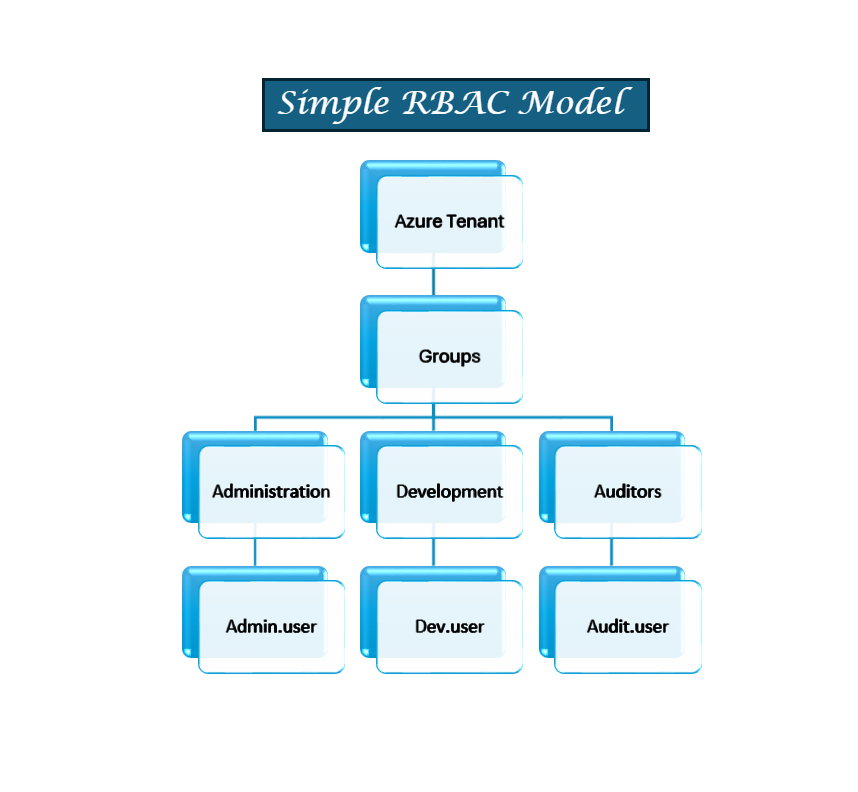

# Azure Identity and RBAC Lab

## Overview

This project demonstrates how to implement identity management and role-based access control in Microsoft Azure using Microsoft Entra ID.

The goal of this lab was to simulate how an organization controls access to infrastructure using security groups and RBAC.

## Architecture

The RBAC model used in this lab demonstrates how Azure role-based access control organizes permissions through users and security groups inside a tenant.

## Explanation

The environment follows a simple RBAC hierarchy:

Tenant  
→ Groups
→ Users  

Groups were created to represent different organizational roles:

• IT-Admins – infrastructure management  
• Developers – read-only access to resources  
• Auditors – visibility for compliance review  

Users were assigned to groups, and RBAC roles were applied at the Resource Group scope to enforce the principle of least privilege.
• Adminis- Virtual Machine Contributors
• Developers- Readers
• Auditors- Readers

## Technologies Used

Microsoft Azure  
Microsoft Entra ID  
Azure Virtual Machines  
Azure RBAC  

## Key Concepts Demonstrated

Identity management  
Security groups  
RBAC role assignments  
Least privilege access model  
Azure infrastructure deployment  

## Lab Components

Resource Group  
Virtual Network  
Virtual Machine  
Security Groups  
RBAC Roles  

## Learning Outcomes

Configured users and groups in Entra ID  
Assigned RBAC roles at the resource group scope  
Implemented least privilege access control  
Tested role permissions across multiple user accounts
